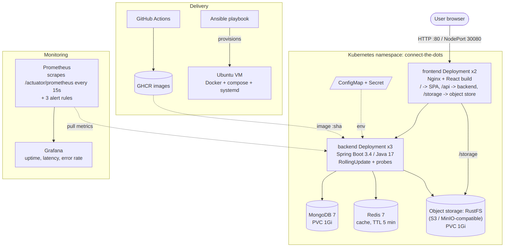
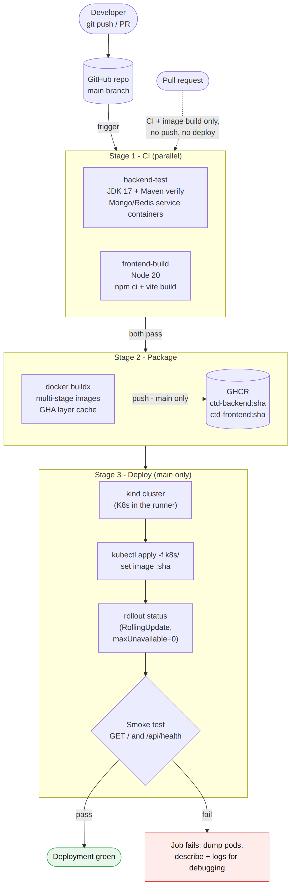

# Connect-The-Dots — DevOps Implementation

This document covers the five DevOps tasks applied to Connect-The-Dots: CI/CD, configuration management, containerization and orchestration, monitoring, and a reflection.

| Task | Tool chosen | Where it lives |
|---|---|---|
| 1. Deployment pipeline | GitHub Actions | `.github/workflows/ci-cd.yml`, `docs/diagrams/pipeline.png` |
| 2. Configuration management / IaC | Ansible | `ansible/` |
| 3. Containers & orchestration | Docker + Kubernetes | `backend/backend/Dockerfile`, `frontend/Dockerfile`, `k8s/`, `scripts/k8s-rolling-update-demo.sh` |
| 4. Monitoring | Prometheus + Grafana | `monitoring/`, `scripts/generate-traffic.sh` |
| 5. Reflection | — | this file, `docs/diagrams/architecture.png` |

---

## 1. Architecture



The application is five services behind one entry point:

- **Nginx + React (frontend)** — serves the single-page app and acts as a *reverse proxy* (a server that receives every request and forwards it to the right internal service): `/` → static files, `/api/*` → backend, `/storage/*` → MinIO.
- **Spring Boot backend** — the only service that talks to the data stores.
- **MongoDB** stores metadata, **Redis** caches the metadata list for 5 minutes, **an S3-compatible object store** stores uploaded files. This was MinIO; it is now **RustFS** under the same service name `minio` (see Challenges).

**What was changed in the application to support DevOps work, and why:**

| Change | Why |
|---|---|
| Added `spring-boot-starter-actuator` + `micrometer-registry-prometheus` | *Actuator* adds operational endpoints (health, info, metrics). *Micrometer* is the metrics library inside Spring; its Prometheus registry formats those metrics as text Prometheus can read at `/actuator/prometheus`. Without this there is nothing to monitor. |
| Enabled liveness/readiness health groups | Kubernetes needs two different questions answered: "is the process stuck?" (liveness) and "can it take traffic right now?" (readiness). Mixing them causes needless restarts. |
| `info.app.version=${APP_VERSION}` | Shows which version each pod runs at `/actuator/info`, so a rolling update can be *seen*. |
| Mongo URI now reads `SPRING_DATA_MONGODB_URI` | It was hard-coded; config must come from the environment so the same image runs in compose, Kubernetes and CI. |
| New `frontend/Dockerfile` | The original compose file mounted `frontend/dist` from the host disk. Pods in Kubernetes cannot see your laptop's files, so the built React app is baked into an Nginx image instead. |
| Backend Dockerfile: non-root user, container-aware heap, HEALTHCHECK | Least privilege; `MaxRAMPercentage` makes the JVM size its heap from the container's memory limit instead of the host's RAM (otherwise it can get OOM-killed). |
| Runtime base switched from `eclipse-temurin:17-jre-alpine` to `eclipse-temurin:17-jre` | The alpine JRE is published for x86_64 only, so the image could not build on ARM laptops (Apple Silicon, Snapdragon). The Ubuntu-based image is multi-arch. |
| `.gitattributes` forces LF for `.sh`/`.yml` | Git on Windows converts to CRLF by default, which breaks bash scripts. |
| `.env` added to `.gitignore` | A real `.env` was committed. **Also run `git rm --cached .env`** so it stops being tracked. |

---

## 2. Task 1 — CI/CD pipeline (GitHub Actions)

**Why GitHub Actions:** the code is already on GitHub, it's free for public repos, needs no server, and has a built-in container registry (GHCR) and secrets (`GITHUB_TOKEN`), so the whole pipeline runs with zero external setup.



### Pipeline flow

| Stage | Job | What happens | Why |
|---|---|---|---|
| CI | `backend-test` | JDK 17, `mvnw verify` with throwaway MongoDB and Redis *service containers* (containers GitHub starts next to the job) | `@SpringBootTest` boots the full app; real databases make the test meaningful. |
| CI | `frontend-build` | Node 20, `npm ci`, `vite build` | Catches broken builds. `npm ci` installs exactly what the lock file says (reproducible). |
| Package | `docker` | Builds both images with *Buildx* (Docker's advanced builder) and pushes to GHCR tagged with the commit SHA and `latest` | Tagging by commit SHA makes every image traceable to the exact code and makes rollbacks precise. Layer cache (`type=gha`) speeds rebuilds. |
| Deploy | `deploy` | Creates a *kind* cluster (Kubernetes-in-Docker, a real cluster inside the CI runner), loads the images, `kubectl apply`, waits for rollout, then smoke-tests `/` and `/api/health` through Nginx | Proves the manifests and images actually work together on every push to `main`, without paying for a cloud cluster. On failure it dumps pod state and logs. |

Rules: jobs run in order via `needs:`; pull requests run CI and build images but **do not push or deploy**; `concurrency` cancels an older run when a newer commit arrives.

### Setup (one-time)
1. Push to `main`. The workflow appears under the **Actions** tab.
2. Packages are created as private. To let others pull them: GitHub → your profile → *Packages* → `ctd-backend` → *Package settings* → change visibility.

**Screenshots to take:** the Actions run graph with all 4 jobs green; the smoke-test step log showing the `/api/health` JSON; the Packages page with both images.

---

## 3. Task 2 — Configuration management (Ansible)

**Why Ansible over Puppet:** Ansible is *agentless* (it just SSHes into the server; Puppet needs an agent installed on each machine and a master server), and playbooks are plain YAML. For one or a few servers it's far less setup.

**Key terms**
- **Inventory** (`inventory.ini`) — the list of servers, grouped (`[app_servers]`).
- **Playbook** (`site.yml`) — ordered tasks to run against a group.
- **Module** — a unit of work (`apt`, `user`, `template`...). Modules are *idempotent*: running the playbook twice changes nothing the second time, because each module checks the current state first.
- **Template** (Jinja2, `.j2`) — a config file with variables filled in per server.
- **Handler** — a task that runs only if something notified it (e.g. restart the app only if its config changed).

### What the playbook does
| # | Area | Tasks |
|---|---|---|
| 1 | Packages | base tools (git, curl, ufw...), Docker's official apt repo, Docker Engine + Compose plugin, enable Docker on boot |
| 2 | Users | system user `ctd` (no login shell — it only runs the app) in group `docker`; admin user `devops` with sudo |
| 3 | Files | `/opt/connect-the-dots` + log dir (mode 0750), git clone of the repo, `.env` with secrets (mode **0600**, owner-only), production `docker-compose.prod.yml`, a *systemd unit* so the stack starts on boot like any OS service |
| 4 | Firewall | UFW: allow 22, 80, 3000, 9090; deny everything else |
| 5 | Verify | start the service, poll `/api/health` until it returns 200 |

### Run it
```bash
cd ansible
ansible-galaxy collection install -r requirements.yml
# edit inventory.ini: your VM's IP, or use the localhost line
ansible all -m ping                    # connectivity check
ansible-playbook site.yml --check --diff   # dry run: shows what WOULD change
ansible-playbook site.yml              # apply
ansible-playbook site.yml              # run again: should show changed=0 (idempotency)
```
A free test VM: VirtualBox/Multipass Ubuntu 24.04, or an AWS EC2 t3.small. Give it at least 4 GB RAM (the Maven build is heavy).

**Screenshots:** `ansible all -m ping` success; first run's PLAY RECAP; second run with `changed=0`; on the server `id ctd`, `ls -l /opt/connect-the-dots`, `systemctl status connect-the-dots`.

---

## 4. Task 3 — Docker & Kubernetes

**Key terms**
- **Multi-stage build** — the first stage has Maven/Node to compile; the final image copies only the output. Result: a small image without build tools (smaller attack surface, faster pulls).
- **Deployment** — tells Kubernetes "keep N copies of this pod running" and manages updates. It creates a **ReplicaSet** per version; old ReplicaSets are what make rollback possible.
- **Service** — a stable name and IP in front of changing pods. The services are named `backend` and `minio` on purpose: the existing `nginx.conf` proxies to `backend:8080`, so it works in Kubernetes unchanged.
- **ConfigMap / Secret** — settings and credentials injected as environment variables, kept out of the image.
- **PVC** (PersistentVolumeClaim) — disk storage that survives pod restarts (MongoDB, MinIO).
- **Probes** — `startupProbe` gives Spring Boot up to 150 s to start; `readinessProbe` removes a pod from the Service until it's ready; `livenessProbe` restarts a hung container.

### Rolling update settings (backend)
```yaml
replicas: 3
minReadySeconds: 10
strategy:
  rollingUpdate:
    maxSurge: 1        # may run 4 pods briefly
    maxUnavailable: 0  # never fewer than 3 ready -> zero downtime
```
Kubernetes starts 1 new pod, waits until it passes readiness for 10 s, then removes 1 old pod, and repeats. If a new pod never becomes ready, the old ones keep serving and the rollout stalls instead of taking the app down.

### Demo
```bash
# Docker Desktop: Settings -> Kubernetes -> Enable Kubernetes  (or: minikube start --cpus=4 --memory=6g)
bash scripts/k8s-rolling-update-demo.sh
```
The script pauses at each screenshot moment:
1. v1 running with 3 backend pods.
2. A `version-watcher` pod calling the API every second (follow it in a second terminal).
3. **Rolling update v1→v2** — pods replaced one by one; the watcher shows v1 and v2 answers mixed, then only v2, never an error.
4. **Broken release v3** (image doesn't exist) — 1 new pod stuck in `ImagePullBackOff`, the 3 v2 pods keep serving.
5. **Rollback** with `kubectl rollout undo` and `kubectl rollout history` showing the revisions and their change-cause.

Open the app: http://localhost:30080 on Docker Desktop, or `minikube service frontend -n connect-the-dots`.

---

## 5. Task 4 — Monitoring (Prometheus + Grafana)

**Key terms**
- **Prometheus** — a time-series database that *pulls* (scrapes) metrics from `/actuator/prometheus` every 15 s.
- **Grafana** — dashboards on top of Prometheus.
- **PromQL** — Prometheus's query language.
- **Histogram / percentile** — p95 latency = 95% of requests were faster than this. Averages hide slow outliers; percentiles don't.

### Run it (alongside the existing compose stack)
```bash
cd frontend && npm ci && npm run build && cd ..        # original compose still mounts dist/
docker compose -f docker-compose.yml -f monitoring/docker-compose.monitoring.yml up -d --build
bash scripts/generate-traffic.sh http://localhost 300
```
- Prometheus: http://localhost:9090 → *Status → Targets* (backend should be **UP**)
- Grafana: http://localhost:3000 (admin / admin) → *Dashboards → Connect-The-Dots → Service Health* (auto-provisioned, no clicking needed)

### Dashboard panels
| Panel | Query idea | Why it matters |
|---|---|---|
| Backend status | `up{job="backend"}` | Is the service reachable at all |
| Uptime | `process_uptime_seconds` | Resets on every restart/redeploy — spots crash loops |
| Availability 24h | `avg_over_time(up[24h])` | The SLA-style number |
| Request rate | `rate(http_server_requests_seconds_count[1m])` by endpoint | Traffic shape |
| Latency p50/p95/p99 | `histogram_quantile(...)` | User-perceived speed |
| Error rate % | 5xx ÷ all requests (4xx shown separately) | Server faults vs. client mistakes |
| JVM heap, CPU | `jvm_memory_used_bytes`, `process_cpu_usage` | Capacity |

`/actuator/*` is excluded from traffic panels so Prometheus's own scrapes don't pollute the numbers.

**Alert rules** (`monitoring/prometheus/alerts.yml`): BackendDown (1 min), HighErrorRate (>5% for 2 min), HighLatencyP95 (>500 ms for 5 min). See them under *Alerts* in Prometheus.

**Make the graphs move for screenshots:** `docker compose stop redis` → `/api/health` returns 503 → error rate rises; `docker compose start redis` → recovers; `docker compose restart backend` → status DOWN briefly, uptime resets.

---

## 6. Challenges

1. **Frontend relied on a host-mounted `dist/` folder.** Worked in compose, impossible in Kubernetes. Fixed with a multi-stage Nginx image.
2. **No observability in the app.** Added Actuator + Micrometer; enabled the latency histogram explicitly, since without it p95 can't be computed.
3. **Spring Boot's slow start vs. liveness probes.** Spring Boot takes 20–40 s to start. A liveness probe alone would kill the JVM before it finished starting and cause a restart loop, so a `startupProbe` holds off liveness checks for up to 150 s.
4. **Liveness must not depend on databases.** If Redis goes down and liveness checked Redis, Kubernetes would restart every healthy backend pod for nothing. Liveness/readiness groups check the app itself.
5. **Hard-coded config and a committed `.env`.** Moved config to environment variables (ConfigMap/Secret, Ansible template with mode 0600).
6. **MinIO disappeared from Docker Hub.** The first post-merge pipeline run deployed everything except storage. The backend answered `/api/health` with 503. A second run, which waited for every service, showed the real cause: the MinIO pod never became ready. Locally, `docker compose` failed with *pull access denied for minio/mc, repository does not exist*. MinIO stopped publishing free images in October 2025 and deleted its Docker Hub repositories in September 2026, so the original project's compose file no longer works for anyone. Fix: replace it with **RustFS**, an Apache-2.0, S3-API-compatible drop-in on the same port. The service keeps the name `minio`, so `nginx.conf`, the backend config and the MinIO Java SDK needed no code changes. The bucket-creation helper (`minio/mc`) was dropped because the backend already creates the bucket on first upload. The smoke test was also hardened: it now waits for every deployment and retries the health check, because a pod being *Ready* doesn't mean its dependencies are. Lessons: pin and mirror third-party images you depend on; an S3-compatible API (rather than a specific vendor) made the swap a configuration change instead of a rewrite.
7. **Running Ansible on WSL2 (ARM64).** Three real problems, in order. (a) Every Ansible command froze: a stuck WSL VM (likely after the laptop slept) made anything waiting on a timer or child-process pipe hang. Isolated step by step (shell OK, user lookup OK, Python + pipe + external program hung), fixed with `wsl --shutdown`. (b) That forced shutdown left the freshly cloned files at 0 bytes (writes not yet flushed to disk), so Ansible saw an empty inventory; fixed by re-cloning. Habit: `sync` before shutting WSL down. (c) The clone task failed with `chmod: invalid mode 'A+user:ctd...'`: becoming an unprivileged user (`become_user: ctd`) needs `setfacl`, from the `acl` package, which minimal Ubuntu lacks. Fixed in the playbook (added to `base_packages`), so any fresh server gets it.
8. **GHCR needs lowercase image names** but the owner is `Riya54671`; the pipeline lowercases it.
9. **Testing deployments without a paid cluster.** Solved with kind inside the CI runner.

## 7. Lessons learned

- **Build once, deploy the same artifact everywhere.** The image tagged with the commit SHA is what CI tests, what Kubernetes runs, and what you roll back to.
- **Configuration belongs in the environment, not the code or the image.**
- **Health checks are a design decision.** Readiness vs. liveness choices directly decide whether an outage is contained or amplified.
- **`maxUnavailable: 0` + readiness probes turn a bad release into a stalled rollout instead of downtime**; rollback is one command because old ReplicaSets are kept.
- **Idempotency** (Ansible) means the playbook doubles as documentation and drift correction.
- **Percentiles over averages** for latency; **separate 4xx from 5xx** so client mistakes don't look like outages.

## 8. Known limitations / next steps

- MongoDB, Redis and the object store run as single replicas (fine for a demo, not HA). Production would use StatefulSets or managed services.
- `rustfs/rustfs:latest` should be pinned to a specific version (and ideally mirrored to our own registry) once a release is chosen; `latest` can change underneath you, which is exactly how MinIO broke.
- Secrets in `k8s/01-config.yaml` and `group_vars` are demo values; use Ansible Vault / Sealed Secrets / an external secret manager.
- The deploy stage targets an ephemeral kind cluster; pointing it at a real cluster means adding a kubeconfig secret and an approval on the `staging` environment.
- No Alertmanager configured, so alerts are visible in Prometheus but not sent anywhere.
